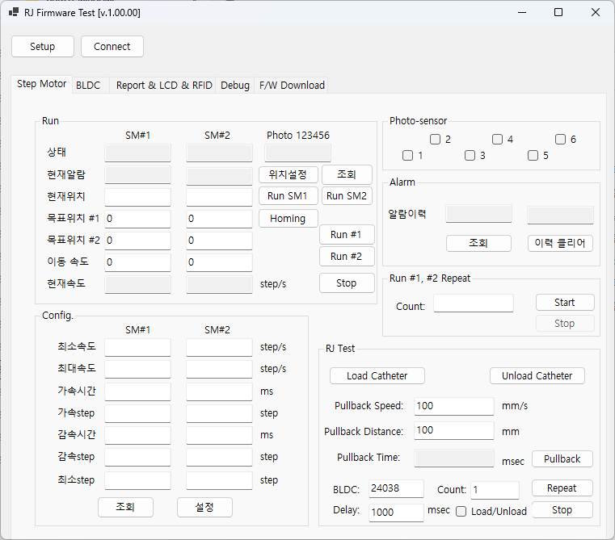
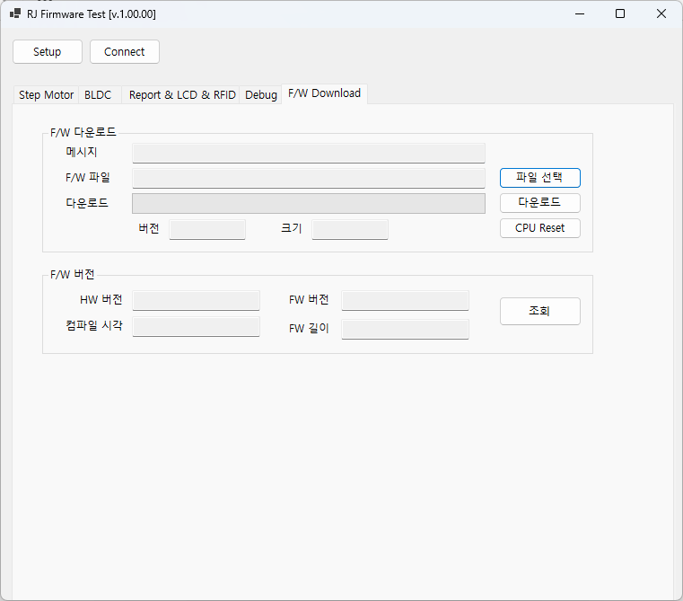
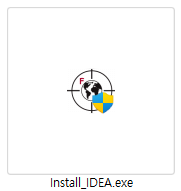
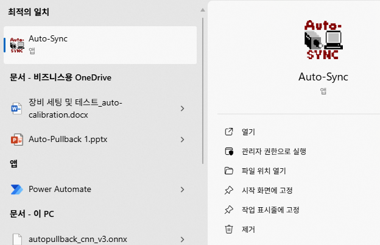
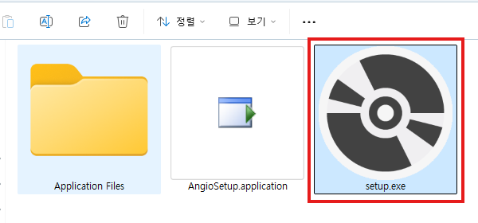
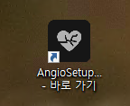

# RaywattOCT
Intravascular OCT System Development Project   
작성일: 2025-10-14
***
# Setting
## [CommunityToolkit]

.Net SDK Issue
* [참고](https://github.com/dotnet/wpf/issues/6792)
* Download & Install [.Net 6.0.304](https://dotnet.microsoft.com/en-us/download/dotnet/thank-you/sdk-6.0.304-windows-x64-installer)

## [Database]

**Install PostgreSQL**
1. PostgreSQL 다운로드
   - [링크](https://www.enterprisedb.com/downloads/postgres-postgresql-downloads) 접속    
   - 최신 버전 중 Windows x86-64 탭 다운로드
2. 설치 및 설정    
   * 다운 바든 설치 파일 실행 하여 설치  
   * Port 설정: 5432
   * 시스템환경 변수 PATH 추가
     * 변수: PostgreSQL
     * 값: C:\Program Files\PostgreSQL\14\bin
   * 비밀번호 설정: 1111   

<!--
테이블 설계서(2023.09.14 Updated)
[테이블 설계서_20230914.xlsx](https://github.com/Raywatt/RaywattOCT/files/12605239/_20230914.xlsx)
-->

**Database Initial Setting**
1. Tablespace를 위한 폴더 생성 
   - 위치: C:\Tablespace
2. SQL 파일이 있는 폴더로 이동
3. 해당 위치에서 **명령 프롬프트** 실행
3. 아래 sql script 를 차례대로 실행

    (a) ```psql --dbname=postgres --username=postgres --file=".\Prerequisite.sql"```

    (b) PostgreSQL 설치 시, 입력한 기본 계정 암호 입력  (비밀번호: 1111)

    (c) ```psql --dbname=rv_database --username=rv_user --file=".\DDL.sql"```

    (d) rv_user 암호 (raywatt) 입력

    (e) ```psql --dbname=rv_database --username=rv_user --file=".\DML.sql"```

    (f) rv_user 암호 (raywatt) 입력

4. 변경 내용 추가 방법  
      (a) DB Table 변경 할 시, 3번 항목의 (c) ~ (f) 실행
5. Import/Export 방법  


(Tool에서 Import/Export 기능 불가 시 [링크](https://velog.io/@myway00/Postgre-error-Utility-file-not-found.-Please-correct-the-Binary-Path-in-the-Preferences-dialog-오류-해결-1분만-투자하면-해결-ㅆㄱㄴ) 참고)

* DB Schema 변경 시 Import/Export
  - Import/Export -> Columns -> Import/Export 할 Columns 선택 (헤더 불필요)

## [CUDA]

1. [링크](https://developer.nvidia.com/cuda-11-8-0-download-archive?target_os=Windows&target_arch=x86_64&target_version=11&target_type=exe_local) 접속 
2. **CUDA Toolkit 11.8.0** Download 및 설치 수행
<!--* CUDA Toolkit 11.8.0 Download(https://pytorch.org/get-started/locally/) & 설치 -->

## [Axsun]

**Download & Install OCT Host** 
1. [OCT Host (.exe)](https://docs.axsun.com/axsun-technologies-knowledge-base/other/downloads) 다운로드 후 설치 (ver 1.17.15)
2. DLL Register

    (a) Command Prompt 관리자 권한으로 실행

    (b) ```C:\Program Files\Axsun\Axsun OCT Control``` 로 이동
    
    (c) ```c:\Windows\Microsoft.NET\Framework64\v4.0.30319\RegAsm.exe AxsunOCTControl.dll /tlb:AxsunOCTControl.tlb /codebase``` 입력
    
    (d) ```C:\Program Files\Axsun\Axsun OCT Control\AxsunOCTControl.tlb``` 파일 생성 확인

## [DAQ]
1. DAQ Model에 맞게 Driver를 설치   
   - Board에 표시 된 Model 정보 확인  
2. ATS9371  
   - [링크](https://www.alazartech.com/en/product/ats9371/4/) 접속
   - Drivers 항목에 **ATS9371 x86_64 driver for Windows** 다운 로드  
  (만약 찾기 어려울 시 해당 [링크](https://www.alazartech.com/en/download/product/16729/55/ats9371-x8664-driver-for-windows/7-13-9/) 접속)
   - 다운 로드 후, 설치 실행
3. ATS9364
   - [링크](https://www.alazartech.com/en/product/ats9364/661/) 접속
   - Drivers 항목에 **ATS9364 x86_64 driver for Windows** 다운 로드  
  (만약 찾기 어려울 시 해당 [링크](https://www.alazartech.com/en/download/product/16728/672/ats9364-x8664-driver-for-windows/7-13-9/) 접속)
   - 다운 로드 후, 설치 실행

## [Python]

1. Python Download & Install
   - [링크](https://www.python.org/downloads/) 접속
   - 최신 버전 다운로드 및 설치  

    ※ 설치 시, 환경변수 추가 (Add Python 3.XX to PATH 선택)
2. Python Package Install
   - 명령 프롬프트에서 ```pip install numpy pillow scipy imageio pywin32``` 실행
     
     ※ 인터넷 연결이 안되어 있을 경우 처리방안
     
     [인터넷 없는 환경 package 설치.docx](https://github.com/user-attachments/files/18434123/package.docx)

3. 환경 변수 추가
   - 시스템 변수에 등록  
   - 변수명: PYTHON_DLL
   - 값: C:\Users\Raywatt\AppData\Local\Programs\Python\\**{PythonXXX}\\{pythonXXX.dll}** 추가  
   ※ **{PythonXXX}\\{pythonXXX.dll}** 은 Python dll에 맞게 경로 적용

4. 코드 복사
   - RaywattOCT\RaywattExt\Python\ImageProcess.py 파일을 C:\Raywatt\system\runtime에 복사

## [Font]

**Download & Install Font**
1. [Pretendard](https://github.com/orioncactus/pretendard) 접속
2. 최신 버전 다운로드 후 압축 해제
3. 설치
   - /Pretendard/public/static/alternative/Pretendard-Bold.ttf
   - /Pretendard/public/static/alternative/Pretendard-Medium.ttf
   - /Pretendard/public/static/alternative/Pretendard-Regular.ttf
   - /Pretendard/public/static/alternative/Pretendard-SemiBold.ttf

**설치 확인**
1. Window 설정 -> 개인 설정 > 글꼴
2. Pretendard 검색
3. 확인

## [Cursor]
**Download & Create Folder, Copy/Paste**
1. [cursor.zip](https://github.com/user-attachments/files/21361471/cursor.zip) 다운로드
2. 압축 해제
2. 압축 해제한 cursor 폴더를 ```C:\Raywatt\system\image``` 으로 이동  

**(필요시 진행) Windows Default Mouse Cursor Setting**
1. 설정-> Bluethooth 및 장치 -> 마우스
2. 관련설정 -> 더 많은 마우스 설정
3. 포인터
    - 찾아보기에서 cur 파일

## [Environment Variable]
1. Windows 검색창에 **"시스템 환경 변수 편집"** 을 검색 후 클릭
2. "고급"탭에서 하단 **"환경 변수"** 버튼 클릭
3. **"시스템 변수"** 항목 중 변수 이름 : Path(or PATH) 더블클릭
4. **"환경 변수 편집"** 창이 뜨면 "새로 만들기"를 클릭한 후 C:\Raywatt\system\3rdparty에 추가
5. 적용까지 완료 하면 OK

## [Executable file]
1. RaywattApp Project를 Release Build 수행
2. bin 폴더를 외장 저장장치에 복사
3. 폴더명 변경(bin -> runtime)
4. runtime 폴더에서 Release/Debug 폴더 삭제
5. 외장 장치에서 장비 PC의 C:\Raywatt\system 경로에 runtime 폴더 복사 (※ C:\Raywatt\system\runtime)

## [3rdparty]
**Download & Copy/Paste**
1. Raywatt One-Drive [링크](https://raywatt-my.sharepoint.com/personal/jeansu_kim_raywatt_com/_layouts/15/onedrive.aspx?id=%2Fpersonal%2Fjeansu%5Fkim%5Fraywatt%5Fcom%2FDocuments%2F%EA%B3%B5%EC%9C%A0%2Fdevelopment&ga=1) 접속
2. 3rdparty 폴더를 다운로드
3. 다운 받은 3rdparty 폴더를 C:\Raywatt\system에 옮기기

## [FrameGrabber]
1. Raywatt One-Drive [링크](https://raywatt-my.sharepoint.com/personal/jeansu_kim_raywatt_com/_layouts/15/onedrive.aspx?id=%2Fpersonal%2Fjeansu%5Fkim%5Fraywatt%5Fcom%2FDocuments%2F%EA%B3%B5%EC%9C%A0%2Fdevelopment&ga=1) 접속
2. FrameGrabber 폴더를 다운로드 한 후, 폴더를 C:\Raywatt에 추가
3. https://github.com/Raywatt/RaywattOCT/issues/209#issue-2097526663 에서 라이브러리 및 매뉴얼 다운로드
4. 매뉴얼 파일의 목차 1, 2번 진행

## [RJ Firmware]
RJ Firmware 설치 안되어있으면 설치 필요   
1. ```RJTestGUI.exe``` 실행  

2. Setup 버튼 클릭 하여 연결
3. F/W Download 탭 이동  

4. 조회를 통하여 현재 F/W 버전 확인   
5. 최신 F/W 업데이트 필요 시, ```파일 선택``` 버튼 클릭 및 파일 선택   
   - 파일 확장자: ```.bin```  
   (※ F/W 파일은 Raywatt3YsPark 프로젝트에서 관리)  
6. ```다운로드``` 버튼 실행   

## [Windows]
1. 사용자 계정 추가  
   (a) 제어판 > 사용자 계정 > 사용자 계정 > 다른 계정 관리 > PC 설정에서 새 사용자 추가 > 계정 추가 > 이 사람의 로그인 정보를 가지고 있지 않습니다. > Microsoft 계정 없이 사용자 추가
   (b) 사용자 이름 : FASTER / 암호 : faster / 보안 질문 1,2,3 답변 : raywatt
2. 사용자 계정 설정  
   (a) 설정 > 개인 설정 > 색 - 폭풍 선택 (※ Raywatt, FASTER 모두 적용)  
   (b) 설정 > 개인 설정 > 잠금 화면 - 로그인 화면에 잠금 화면 배경 그림 표시 (켬 -> 끔) (※ Raywatt, FASTER 모두 적용)  
   (c) Font 설정 (※ Raywatt, FASTER 모두 적용)  
   (d) [raywattLogoAccount.zip](https://github.com/Raywatt/RaywattOCT/files/12602861/raywattLogoAccount.zip) 다운로드 및 설정 > 계정 사진 변경 > 찾아보기 - 다운받은 이미지 선택 (※ Raywatt, FASTER 모두 적용)  
   (e) 마우스 포인터 설정 (※ FASTER에 적용)  

3. PC 설정

   (a) 전원 관리 옵션 설정 편집 - 디스플레이 끄기/절전 모드 설정 > 해당 없음으로 설정

   (b) 디스플레이 설정 - 디스플레이 복제로 설정

4. 윈도우 잠금화면 해제
   
   (a) 윈도우 + R > gpedit.msc

   (b) 컴퓨터 구성 > 관리 템플릿 > 제어판 > 개인 설정 > 잠금 화면 표시 안 함 > 사용

5. 로그인 창의 네트워크 아이콘 숨기기
   
   (a) 윈도우 + R > gpedit.msc
   
   (b) 컴퓨터 구성 > 관리 템플릿 > 시스템 -> 로그온 > 네트워크 선택 UI 표시 안 함 > 사용   

6. Raywatt App 관리자 권한으로 실행을 위해 레지스트리 수정

   (a) FASTER 계정으로 윈도우 로그인
    
   (b) [ctrl] + [shift] + [esc] 키를 눌러 작업 관리자 실행

   (c) 작업 관리자에서 [파일] - [새 작업 실행] 실행     
   
   (d) 실행의 열기란에 'regdit'을 입력 후, [확인] 버튼을 눌러 레지스트리 편집기 실행

   (e) 'EnableLUA'의 값을 1에서 0으로 수정

       ※ 위치: [HKEY_LOCAL_MACHINE] - [SOFTWARE] - [Microsoft] - [Windows] - [CurrentVersion] - [Policies] - [System]
   
       ※ 수정 방법: [System]을 클릭하면 우측에 나오는 Key들 중에 'EnableLUA' 찾아 더블 클릭하고, 팝업된 편집창에서 '값 데이터'란의 값을 0으로 수정후 확인 버튼 클릭
   
   (f) 윈도우 재시작

   관련 링크: https://url.kr/fsv46g

8. Shell Launcher (고정 프로그램)
   
   (a) 제어판 > 프로그램 > 프로그램 및 기능 > Windows 기능 켜기/끄기 > Device Lockdown(디바이스 잠금) > Shell Launcher(셸 시작 관리자) 체크
   
   (b) 관리자 권한 PowerShell 실행 > `Set-ExecutionPolicy Unrestricted` 입력 후 `Y`

   (c) [ShellLauncher.zip](https://github.com/user-attachments/files/18777482/ShellLauncher.zip) 다운로드 및 `ShellLauncher_enable.ps1` 실행
   
       ※ ShellLauncher_enable.ps1에서 스케줄러에 등록된 RaywattApp을 실행하게 설정
   
       ※ 설정이 잘 못되었을 경우, ShellLauncher_disable.ps1 실행해서 설정 내용 해제 가능
   
   (d) 스크립트 실행 (경고 발생)

9. 부팅 로고 변경

    (a) [HackBGRT-1.5.1_Raywatt.zip](https://github.com/Raywatt/RaywattOCT/files/12582646/HackBGRT-1.5.1_Raywatt.zip) 다운로드 후 setup.exe 실행

    (b) 'I', 'I' 입력 후 메모장 닫기 > 저장

    (c) Bios Logo Disabled

       (1) 안전 모드 진입 (shift + 다시 시작)
       (2) 문제 해결 > 고급옵션 > UEFI 펌웨어 설정 > 다시 시작
       (3) 설정 화면 (※ BARCO 모니터의 경우, 설정 화면이 안 보이는 경우가 있어 다른 모니터 이용하는 편이 좋음)
       (4) SETTING > Boot > Full Screen Logo Display (Enabled -> Disabled 변경) > Exit


## 설정 후, 꼭 확인해야 하는 항목 (App Test)

- Manual Calibration 실행해서 ML 기능 확인
  - 첫 실행 후, ```C:\Raywatt\system\3rdparty\model\yolo```에서 engine 파일이 생성되었는지 확인  
      - 파일명
         - detect.engine.NVIDIAGeForceRTX4060LaptopGPU.fp16.1.1
         - segment.engine.NVIDIAGeForceRTX4060LaptopGPU.fp16.1.1
<!-- - Tiff 저장 기능 확인 -->
- raycore.ini 파일
   - 위치: C:\Raywatt\system\runtime
   - 파라미터 변경 하기전, 프로그램을 종료 후 변경
   - 주요 확인 필요한 파라미터
      - LaserModule: 레이저 sweep 및 광학 제어  
         - DelayLine: 시스템 마다 설정 값 확인 필요
      - StepMotor: 
         - UnLoadDistance: 체결 관련 파라미터 (Default 값: 9650)   
         (※ 시스템 마다 체결 조절이 상이할수 있으므로 변경하며 최적의 값 입력)
      - BLDCMotor: BLDC 관련 파라미터
         - VelocityPullback: BLDC 회전 속도 제어  
         (※ 만약 400rpm이 불가능한 RJ라면 속도를 줄여서 맞는 rpm으로 설정)
      - Catheter: Cather 검사 관련 파라미터
         - CatheterRFID: Catheter의 RFID를 사용하지 않을 시, 0으로 설정
         (※ 사용시, 1로 설정)

<!--
## Local 환경 설정 참고

- App 종료 시, Power Off/Switch User가 호출되지 않도록 설정 방법(https://github.com/Raywatt/RaywattOCT/pull/173#issue-1892013269)

  ※ 아래와 같이 buffer 컬럼에 본인 windows의 계정 추가 필요
  
  
-->
## [FGServer]
1. 파일 다운로드  
   FGserver 구성하기 위한 프로그램 다운로드 [링크](https://raywatt-my.sharepoint.com/:f:/p/hwjung/EsxTLO5CRJZBqd7qlC1Q6AgB_PljjmaMyENd5mxoNW8HMQ?e=HDUJqY) 접속  

2. IDEA Auto-SYNC 설치  
   - IDEA.3.6.017.REL 폴더 안에 ```Install_IDEA.exe``` 실행하여 설치 진행    
        
   - 설치 완료 후, 설치 파일 확인  (Auto-Sync)  
        
   - 현재(2025-10-23)기준 최신 버전 확인  
      - [링크](https://www.fi-llc.com/support) 접속  
3. Angiosetup 설치  
   - 폴더 ```[20250822]Angio Install file``` 접속   
   - Setup.exe 실행하여 설치  
        
   - 설치가 완료 되면 바탕화면에 바로가기 생성 확인   
        
4. .Net framework 8.0 설치  
   - AngioSetup을 실행 하기 위해선 .Net Framework 8.0 설치 필요  
   - [링크](https://dotnet.microsoft.com/ko-kr/download/dotnet/8.0) 에서 해당 버전을 받아 설치  
